# WAQM Configuration Guide

### WAQM Configuration

The Integromat Data Store holds the WAQM configuration needed to map items from Wild Apricot to QuickBooks. Only 1 record is used to drive the Invoice and Donation Scenarios. Additional records represent backups from previous versions of the utility or represent test environments.

Recommendation: Before making significant changes, use the Config Backup scenario to backup the current config record. See instructions in the Maintenance document.

The following sections describe the WAQM Data Store configuration fields along with general guidelines for usage.

**General configuration**

WA Org Name: The name for the Company. This does not drive mapping of records between Wild Apricot and QuickBooks. However, this field may be used in notification emails, folder name formats, and filename formats.

WA Org Env: Reference field to describe differences between configuration records. Example: DEV or TEST or PRD. **RECOMMEND:  Use the phrase "Master" within this field to designate which data store record is the current master record for scenarios.**  The Config BackupRecord scenario appends “-BACKUP" to the end of the value in this field.  This field is used in notifications to clarify which configuration was used in a run.

Config Last Updated: Date field used to signify when the configuration was last updated.  The Config BackupRecord scenario sets the current date and time for this field on the copied record.  **RECOMMEND: If other significant changes are done to a Master record, adjust this to the current date and time as a reference for when the changes were made.**

QB Version: These fields drive the scenario logic as different versions of QuickBooks have different requirements.  The values in **Bold** are the current options and are **REQUIRED** for scenario to function properly.

* QB Country: **CAD** \(Canada\) or  **US** \(United States\)
* QB Platform: **Desktop**  or   **Online**
* QB Online Root URL:   e.g. app.company. qbo.intuit.com \(allows notification emails to include links to the created transactions\)

WAQM Version Info:  reference fields to indicate which version of WAQM is in place during configuration

* WAQM License Key: For each WAQM run, the key is checked to ensure it is still valid and unexpired.   Visit [https://newpathconsulting.com/waqm](https://newpathconsulting.com/waqm) to buy or extend a WAQM license.
* WAQM Invoice Scenario Version
* WAQM Donation Scenario Version

**Invoice and Donation Customer configuration**

Wild Apricot Field Names:  Since different organizations may use different field names for common Contact fields, this section allows that field name to be specified.  Use the display label without brackets.  Do not enter the System Code for the field.  Currently Supported fields:

* Wild Apricot System Fields - WAQM defaults in this name/config \(may be changed if needed\)
  * User ID
  * First Name
  * Last Name
  * Email
  * Phone
  * Organization
* Not a standard Wild Apricot field - must enter the Display Label from client's Wild Apricot account
  * Street Address 1
  * Street Address 2
  * City
  * Province \(assumes a drop-down field is used to pick the Province/State\)
  * Postal Code
  * Country \(assumes a drop-down field is used to pick the Province/State\)

QB Desktop Name Format: This field configures which fields from Wild Apricot are used to define the Customer \(Member/Contact\) Name on the Invoice/Donation inside QuickBooks Desktop. The supported tokens listed below are supported.  \(see example in screenshot below\)

* {Organization} - pulls the Organization Name for the Wild Apricot Contact record
* {User Id} - pulls the User ID for the Wild Apricot Contact record
* {Display Name} - pulls the Display Name for Wild Apricot Contact record; the format for the Display Name is configured inside Wild Apricot.  This is used if nothing is specified inside the configuration.
* {Full Name} - uses the First Name and Last Name together
* {Email} - primary email address from Wild Apricot
* NOTES: 
  * The Customer Name field is truncated to 41 characters as that limit is enforced by QuickBooks.
  * The tokens assume that the WA field mappings in the previous section are properly configured. 
  * N/A for Quickbooks Online

QB Desktop Billing Address Format: These fields configure which fields from Wild Apricot are used to define each line of the “Bill To” field on the QuickBooks Invoice or Donation. 5 lines are allowed by QuickBooks. The supported tokens listed below are supported.  \(see example in screenshot below\)

* Address1: {Organization}, {Display Name}, {Full Name}, {User Id}, {Email}
  * {Display Name} is used if nothing specified inside the configuration.
* Address2: {Organization}, {Display Name}, {Full Name}, {User Id}, {Email}
  * {Organization} is used if nothin is specified in the configuration
* Address3: {Street Address 1}, {Street Address 2}, {City}, {Province}, {Postal Code}, {Country} 
  * {Street Address 1} is used if nothing specified inside the configuration.
* Address4: {Street Address 1}, {Street Address 2}, {City}, {Province}, {Postal Code}, {Country}
  * {Street Address 2} is used if nothing specified inside the configuration.
* Address5: {Street Address 1}, {Street Address 2}, {City}, {Province}, {Postal Code}, {Country}
  * {City}, {Province} {PostalCode} is used if nothing specified inside the configuration.
* NOTES: 
  * The Customer Name field is truncated to 41 characters as that limit is enforced by QuickBooks.
  * The tokens assume that the WA field mappings in the previous section are properly configured. 
  * N/A for Quickbooks Online

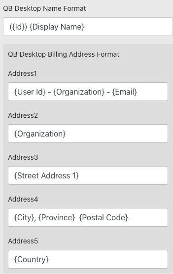

**Invoice mapping configuration**

Invoices Enabled:  set to Yes to allow scenarios to run

Invoice Job Scheduling:  see scheduling section below that applies similarly to Invoices and Donations.  This allows automated scheduling or manual runs for explicit dates.

WA Order Type Items:  This is the key section that defines the mappings between Wild Apricot Order Types and the corresponding accounts, classes, and products inside Quickbooks.  A different config section is created for each Order Type.  \(see screenshot below\)  For each Order Type, default mappings are defined and used for the header in conjunction with the Order Line Item mappings defined in the next section.

* Order Type: The Order Type name from Wild Apricot.  These are standard from Wild Apricot and cannot be changed; this must match exactly.  These are the 6 Order \(Invoice\) Types supported by Wild Apricot. 
  * MembershipApplication
  * MembershipRenewal
  * Membership LevelChange
  * EventRegistration
  * OnlineStore
  * Undefined \(Manual Items\)
* QB Receivables Account: The QuickBooks AR account name used for the order type. Most organizations use “Accounts Receivable”
* QB Receivables Account ID:  \(for QBO only\) The corresponding system ID.
* QB Default Item Product:  The default Quickbooks Inventory List Item \(Product\) that will be used on all line items if not specifically defined for line item mappings. This value is not used on the Invoice Header.
* QB Default Item Product ID:  \(for QBO only\) The corresponding system ID.
* QB Income Account Default: The default Quickbooks Income/Revenue account that will be used on all line items if not specifically defined for line item mappings. This value is not used on the Invoice Header. 
  * NOTE: If a SubAccount is desired, use the Quickbooks format for showing the Parent and child, separated by a colon. e.g. ParentAccount:ChildAccount   
  * NOTE2:  A QBO ID is not required for Income Account.  QBO derives the income account internally using the Product specified.
* QB Header Class: The QuickBooks Class that should be defined for the Invoice Header. Current scenario logic overrides this header value based on the Class defined for the specific line item Class if it is defined. 
  * NOTE: If a Subclass is desired, use the Quickbooks format for showing the Parent and child, separated by a colon. E.g. ParentClass:ChildClass
* QB Header Class ID:  \(for QBO only\) The corresponding system ID.

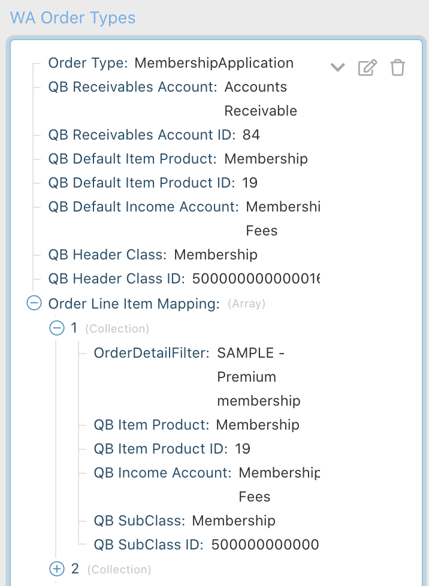

WA Order Line Item Mapping: This section is used to provide further mapping granularity between Wild Apricot and Quickbooks.   WAQM relies on the standard info that Wild Apricot provides in the first line item of an invoice to provide this additional granularity.  All line items on an Invoice will use the same Detail/Line Item mapping unless an exception is defined for ExtraCosts. \(See the next section on ExtraCost Exceptions.\)   _EXAMPLE:  an invoice for a Wild Apricot Member Level called "Professional" could map to one Quickbooks account while an invoice for a different Member Level called "Amateur" could map to a different Quickbooks account._

Each Line Item Mapping section requires these fields for configuration:

* OrderDetailFilter: This is the text searched from the first line item of an invoice to confirm that a specific Detail Mapping applies.  These are the expected standards based on the Order Type.  The filter as defined above for each Order Type. \(e.g. Membership Level name or Event Tag name\)
  * Membership Invoices: \(MembershipApplication, MembershipRenewal, MembershipLevelChange\)  Use the exact Membership Level name from Wild Apricot to represent the Order Detail Filter.
  * EventRegistration Invoices: Use a single Event Tag to represent the Order Detail Filter. NOTE:  Although Wild Apricot allows a single event to have multiple tags, WAQM cannot depend on more than one tag to define the Filter for each config section. 
  * OnlineStore Invoices: Though Wild Apricot does support Tags, these tags are not available to WAQM. Only 1 default mapping can be used for all OnlineStore invoices.   Recommend using "Online Store" as the Order Detail Filter value.
  * Manual Item \(Undefined\) Invoices: By the nature of manual items,  only 1 mapping is supported. Recommend using "Manual Item" as the Oder Detail Filter value.
* QB Item Product: The QuickBooks Inventory List Item \(Product\) to be used for the line item. This will show on the QuickBooks Invoice before the line item notes.
* QB Item Product ID: \(for QBO only\) The corresponding system ID.
* QB Income Account Override: The Income/Revenue account to be used inside QuickBooks for the invoice. In QuickBooks, the Inventory List Item defines the income/revenue account for the line item. However, the IIF import format also requires the account to be defined. The value in the IIF file overrides what is configured inside QuickBooks Desktop.  For Quickbooks Online, this is a reference field only; the income account is controlled by specifying the Product for an item. 
  * NOTE: If a SubAccount is desired, use the Quickbooks format for showing the Parent and child, separated by a colon. E.g. ParentAccount:ChildAccount
  * NOTE2: A QBO ID is not required for Income Account. QBO derives the income account internally using the Product specified.
* QB SubClass: The Quickbooks Class to be used for the line items. If defined at the line item, this value will be used in place of the Class defined at the header Order Type level. 
  * NOTE: If a Subclass is desired, use the Quickbooks format for showing the Parent and child, separated by a colon. E.g. ParentClass:ChildClass
* QB SubClass ID:  \(for QBO only\) The corresponding system ID.

WA Order ExtraCost Exceptions: As described in the OrderType section, all line items on an invoice will use the same Quickbooks mappings for Inventory Item, Account, and Class. This configuration section allows an individual invoice line item to use a different mapping based on the name of the ExtraCost field from Wild Apricot. \(e.g. a New Member Fee line item should be mapped to a different account from the core Membership Dues line items\) This Exception mapping will override the default mappings regardless of Order Type. Each exception requires these fields for configuration.

* ExtraCostName: Use this specific format:  \(Include the word Extras, the colon, and the space.  Do not include the opening and closing brackets around the field name.
  * Extras: &lt;Extra Cost Field Name from Wild Apricot&gt;
* EC QB Item Product: same definition as the Line Item Mapping section
* EC QB Item Product ID: \(for QBO only\) The corresponding system ID.
* EC QB Income Account: same definition as the Line Item Mapping section
* EC QB SubClass: same definition as the Line Item Mapping section
* EC QB SubClass ID:  \(for QBO only\) The corresponding system ID.

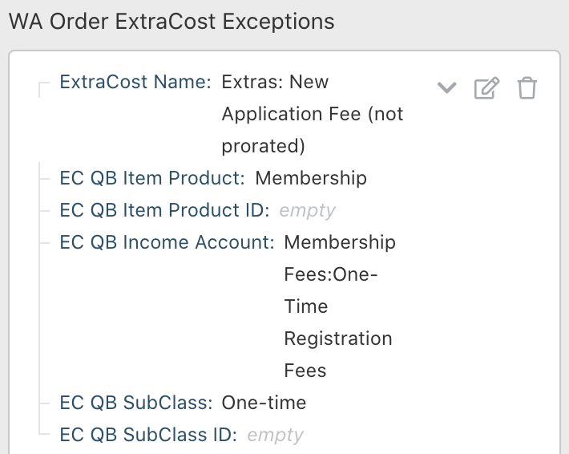

**Donation mapping configuration**

Donations Enabled:  set to Yes to allow scenarios to run

Donation Job Scheduling:  see scheduling section below that applies similarly to Invoices and Donations.  This allows automated scheduling or manual runs for explicit dates.

WA Donation Mapping: This section defines the default mappings that will be used on the QuickBooks “Sales Receipt” for a Donation. The Sales Receipt is similar to the Invoice, but is treated differently inside QuickBooks. 

To provide further mapping granularity, WAQM uses the concept of Donation Campaigns to define which mapping should be used.  Wild Apricot does not provide a standard field for Donation Campaigns.     WAQM assumes that the "Campaign" field is required on a Donation and is defined as a drop-down field with each value in  the drop-down representing a different Campaign.

These are the required Donation Mapping configuration fields:

* WA Campaign Field Name:  By default, Wild Apricot does not have a field for specifying different campaigns or types of Donations.  If an organization does not include a 'Campaign' field inside the Donation, WAQM cannot provide mappings to different accounts for different Campaigns.  If the organization does define Campaign types inside the Wild Apricot Donation, this field is used to list the Label \(Display Name\) for the custom field.   WAQM assumes this custom field is a drop down field, with different campaigns listed as choices within the drop-down.  The field name listed here is the overall field name, not the listings of individual campaign types.
* QB Header Account: A Bank Account, Deposit account or Undeposited Funds to which the Donation will be added. NOTE: If a SubAccount is desired, use the Quickbooks format for showing the Parent and child, separated by a colon. E.g. ParentAccount:ChildAccount
* QB Header Account ID: \(for QBO only\) The corresponding system ID.
* QB Income Account Default: If not defined in the Campaign Types, this Income/Revenue account will be used for the Donation Sales Receipt at the line item level. NOTE: If a SubAccount is desired, use the Quickbooks format for showing the Parent and child, separated by a colon. E.g. ParentAccount:ChildAccount
* QB Item Product: The QuickBooks Inventory List Item \(Product\) to be used for the line item. This will show on the QuickBooks Donation sales receipt before the line item notes.
* QB Item Product ID:  \(for QBO only\) The corresponding system ID.
* QB Header Class: The QuickBooks Class that should be defined for the Donation Sales Receipt Header. Current scenario logic overrides this header value based on the Class defined for the specific line item Class if it is defined. NOTE: If a Subclass is desired, use the Quickbooks format for showing the Parent and child, separated by a colon. E.g. ParentClass:ChildClass
* QB Header Class ID:  \(for QBO only\) The corresponding system ID.
* QB Header Memo Format: This allows default text and placeholder tokens to be defined to pull values from the Donation and insert into the QuickBooks Memo field.  The only standard Wild Apricot donation text field is 'Comment'.  Using a custom Donation field inside this mapping requires WAQM customization.   have limited standard fields and typically use custom fields. This section may require customization in the scenario to support specific choices.
  * Example: {Comment}
  * Example 2:  Note from Donor-{Comment}
* QB Tax Code for Exempt: The QuickBooks tax code to be used on the line item to represent Zero Tax or Tax Exempt.   Donations are assumed to have zero tax applied and do not rely on the WAQM Sales Tax section.
  * Example: E

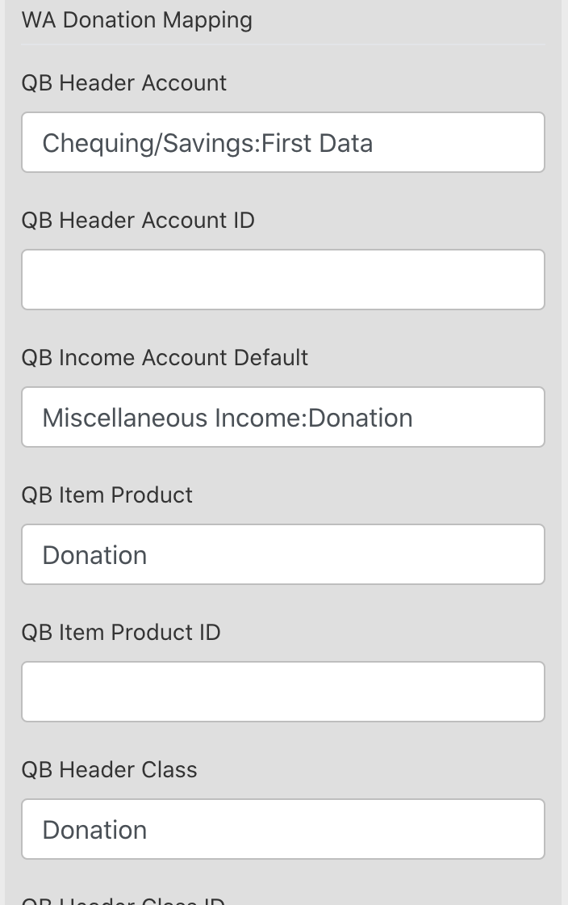

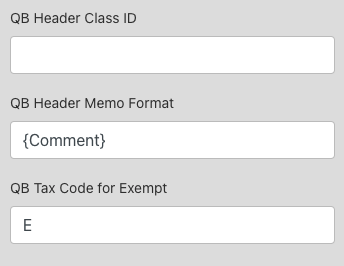

WA Donation Campaigns: This section allows different campaigns to be mapped to different accounts and classes inside QuickBooks. This section assumes the Wild Apricot Campaign field has been listed at the beginning of the Donation mapping configuration. These are the required configuration fields:

* DonationFilter: The name of the Campaign chosen by the Donor. This must match the Label of the drop down list item inside Wild Apricot exactly.  The custom drop down field name is configured separately at the beginning of the Donation mapping configuration.
* QB DON Alt Deposit Account:  For situations in which a company wants Donations to be deposited into different "Bank accounts" in Quickbooks for different campaigns.  If not populated, the Donation Header account will be used.
* QB DON Alt Deposit Account ID: \(for QBO only\)  The corresponding system ID 
* QB DON Item Product: The QuickBooks Inventory List Item to be used for Donations. This will show on the QuickBooks Sales Receipt before the line item notes.
* QB DON Item Product ID:  \(for QBO only\) The corresponding system ID.
* QB DON Income Account: The Income/Revenue account to be used for the Donation campaign. NOTE: If a SubAccount is desired, use the Quickbooks format for showing the Parent and child, separated by a colon. E.g. ParentAccount:ChildAccount
* QB DON Line Notes Format: This allows default text and the name of the Donor's selected Campaign to be inserted into the QuickBooks Line Item Notes field on the Sales Receipt. This configuration assumes that the organization is using a custom drop-down field for selecting the Donation Type.  If this field is left blank, WAQM defaults to use: "Donation For: {Campaign Name}" 
  * Example: Amazing Donation For: {Campaign Name}
* QB DON SubClass: The Quickbooks Class to be used for the line item. If defined at the line item, this value will be used in place of the Class defined at the Donation header. NOTE: If a Subclass is desired, use the Quickbooks format for showing the Parent and child, separated by a colon. E.g. ParentClass:ChildClass
* QB DON SubClass ID:  \(for QBO only\) The corresponding system ID.

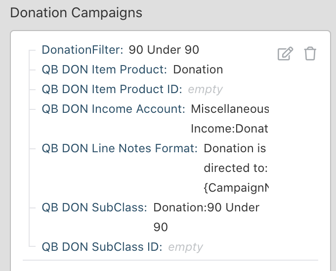

**Sales Tax mapping configuration**

Sales Tax Types: This section maps the tax rates used in Wild Apricot to the taxes in Quickbooks and the associated required fields.  To avoid unexpected behavior, Wild Apricot, Quickbooks, and WAQM must have consistent Sales Tax configurations.

NOTE:  [Reference the separate "Sales Tax Scenario" section](../other-references/sales-tax-scenarios.md) of this document to understand some limitations for some combinations of Sales Taxes, especially for US versions.   This is due to design differences between Wild Apricot and Quickbooks.

* Sales Tax Name: The exact name defined in Wild Apricot. This is the current key used to map invoice details to the corresponding tax in Quickbooks.
* Sales Tax ID: The exact name defined in Wild Apricot. This is currently a reference item only.
* Sales Tax QB Code: The corresponding QuickBooks tax code.
* Sales Tax QB Code ID:  \(for QBO only\) The corresponding system ID.
* Sales Tax Rate: The Tax Rate as a whole or decimal number. \(7 for 7% tax; 7.25 for 7.25% tax\) For Online and CAD Quickbooks versions, this is a reference only as the tax amount is calculated internally to QuickBooks using the Tax Code and Sales Tax Items.
* Sales Tax Account: The account used to receive Sales Taxes. This is required for US Desktop Quickbooks versions.  For other versions, this is a reference only as the account is mapped internally to QuickBooks using the Tax Code and Sales Tax Items.
* Sales Tax Agency Name: The Quickbooks “vendor” used to represent the tax agency to which the sales taxes are due. This is required for US Desktop Quickbooks versions.  For other versions, this is a reference only as the tax agency is defined internally to QuickBooks using the Tax Code and Sales Tax Items.

NOTE: For US versions of Quickbooks, a “NoTax” mapping may be needed when no tax is defined for a line item in Wild Apricot.

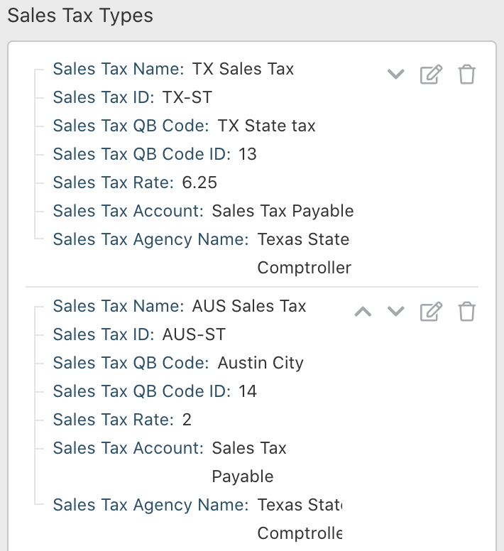

SPECIAL CASE:   Some scenarios may exist where a client requires taxes inside their instance of QBO, but no tax information is configured within their instance of Wild Apricot.  If this occurs, configuring a single Sales Tax entry with the Sales Tax ID = NoTaxInWA can be used to insert a single default Tax Code for all invoices.   \(see screenshot\) .This is introduced in Invoice-QBO v0.6.1.2. 

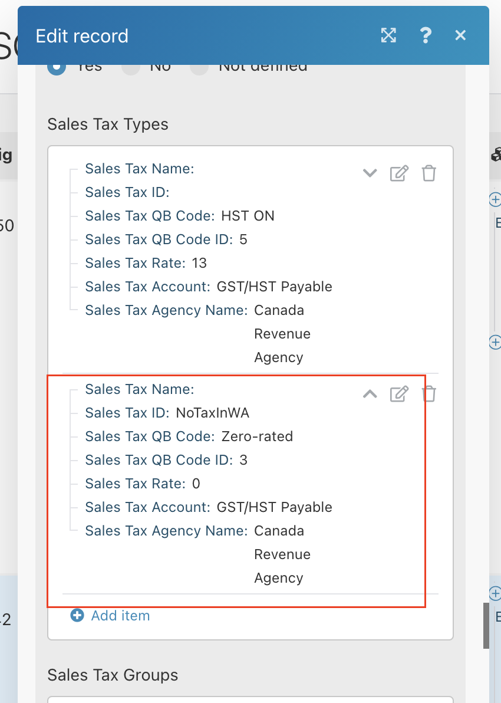

Sales Tax Groups: Sales Tax Groups are used in Quickbooks when a line item uses a composite of multiple individual tax rates. \(e.g. a city tax and a province tax\) Sales Tax Groups do not exist inside Wild Apricot. This section maps which Quickbooks Tax Group is used when a single Wild Apricot line item uses 2 separate Sales Taxes.

* Sales Tax Group Name: The name of the Sales Tax Group. Used for reference only.
* Sales Tax QB Group Code: The Sales Tax Group code inside QuickBooks.
* Sales Tax QB Group Code ID:  \(for QBO only\) The corresponding system ID.
* Sales Tax Group Account: Required for the US Desktop version of Quickbooks for successful IIF import.  The tax calculation is done based on the defined individual tax rates.   For other Quickbooks versions this is a reference only.  The account is defined internally to Quickbooks based on the Sales Tax QB Group Code.
* Sales Tax Group Agency Name: Required for the US Desktop version of Quickbooks for successful IIF import. The tax calculation is done based on the defined individual tax rates. For other Quickbooks versions this is a reference only. The agency is defined internally to Quickbooks based on the Sales Tax QB Group Code.
* WA Tax IDs: Add each Sales Tax Name from Wild Apricot as a separate item in the Tax ID array.  This must exactly match Wild Apricot and the mapping in the individual sales tax rate section.  
  * Example: 1\) GST 2\) PST

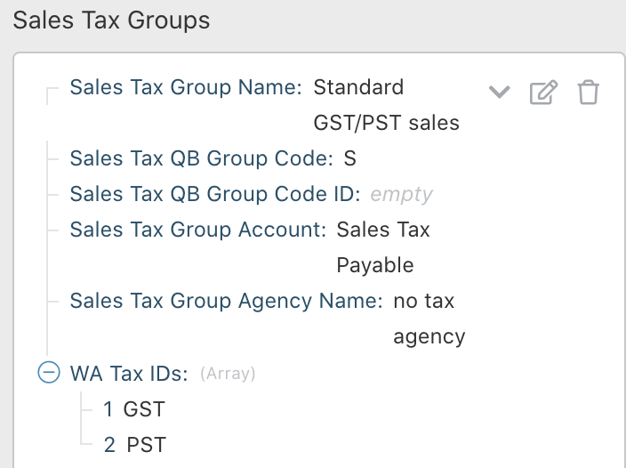

Subtotal List Name: The QuickBooks Sales Inventory Item for Subtotals. This is primarily used for US Desktop versions of Quickbooks.  

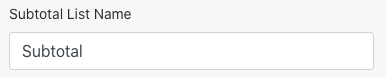

**WAQM scheduling configuration**

WAQM scheduling may be defined separately for Invoices and Donations.   This section describes Invoice scheduling; Donation scheduling is not described explicitly, but works the same way.

WA Invoice Job Scheduling:  Defines the frequency and time periods used when the Invoice scenario runs. 

* Invoice Job Scheduling Type: _\(must enter the keyword phrase in **bold** exactly\)_
  * **Manual Dates** → the scenario will use the Manual Start Date and End Date when it runs to define which Invoices are read from Wild Apricot.
  * **Scheduled** → Each time the job runs, it will read invoices from “today” to the number of periods back from “today”.  In addition, the Integromat scenarios must be set-up to run automatically on the expected frequency and dates.  This is not controlled inside WAQM configuration.  Reference this linked [article](https://support.integromat.com/hc/en-us/articles/360001984973-Scheduling-a-scenario) from Integromat for further instructions.
* Manual Start Date: format = YYYY-MM-DD hh:mm A
* Manual End Date: format = YYYY-MM-DD hh:mm A
* Scheduled Frequency:  **Monthly** or **Daily**  \(for weekly, choose Daily and a number of periods = 7\)
* Scheduled Number of Periods Back: format = \# \(e.g. 1 = 1 month back from “today”\)
* Scheduled-Reference-Run Schedule: reference notes to describe the configured schedule of the Invoice scenario. This does not drive scenario behavior. Scheduling must be done directly on the scenario as described in [this Integromat article](https://support.integromat.com/hc/en-us/articles/360001984973-Scheduling-a-scenario).

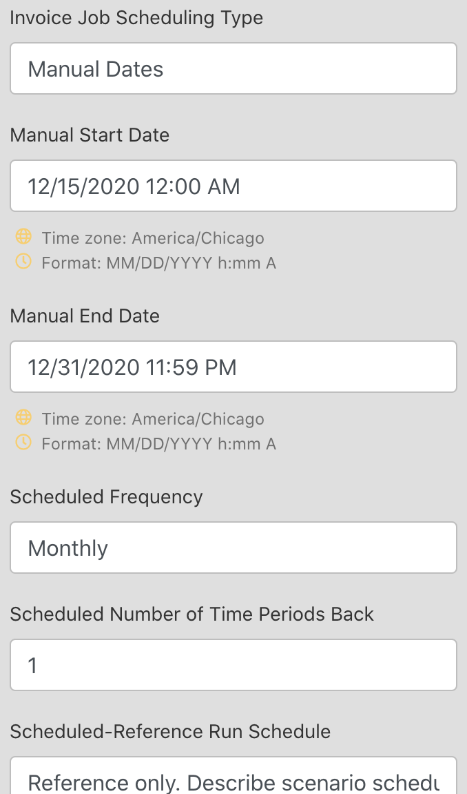

Additional Notes regarding dates and scheduling:

* Scheduled runs are intended to process invoices and donations for an entire period.  e.g. from the 1st day of a month through the last day of a month.  To ensure all documents from the time period are included, the following scheduling assumptions are used by WAQM:
  * The start date for a scheduled run uses midnight as the start time.   00:00:00
  * When the scenario runs, the end date is set as just before midnight of the previous day. 23:59:59
  * Example:   A monthly scenario runs on Dec 1 and is set to run for 1 period back.  The start date is set for Nov 1 at the time of 00:00:00.  The end date is set for Nov 30 at 23:59:59.
* To support Weekly runs, use the Daily mode with the number of periods = 7, 14, etc.
* Manual Dates allow date, hour, and minute to be specified.  Because seconds cannot be specified inside Integromat, WAQM assumes 00 seconds for the start date and 59 seconds for the end date.

**WAQM output file and email configuration**

Output File Location: This section defines the service, folder path, and filenames used for Quickbooks Desktop versions. \(not used for Quickbooks Online\)  This is the location where IIF files are loaded that can later be imported into Quickbooks.  The current scenarios are designed to use the “box” online storage service. The scenarios can be customized to use different services.

* Storage Service: The name of the service. Currently, this is just a reference field.
* Invoice Folder Path: For 'box' this is just a reference field as the folder path must be configured inside the scenario. Other services allow the folder to be mapped using this field.
* Success Invoice Filename Format: This field defines the preferred filename format for the generated Invoice IIF files that are loaded to the online storage service. If the token {DateTime} is included, the current date and time will be inserted in the filename.
* Donation Folder Path, and Filename Format: These fields have the same purpose as the Invoice items above and allow a separate folder and filename for Donation related files.

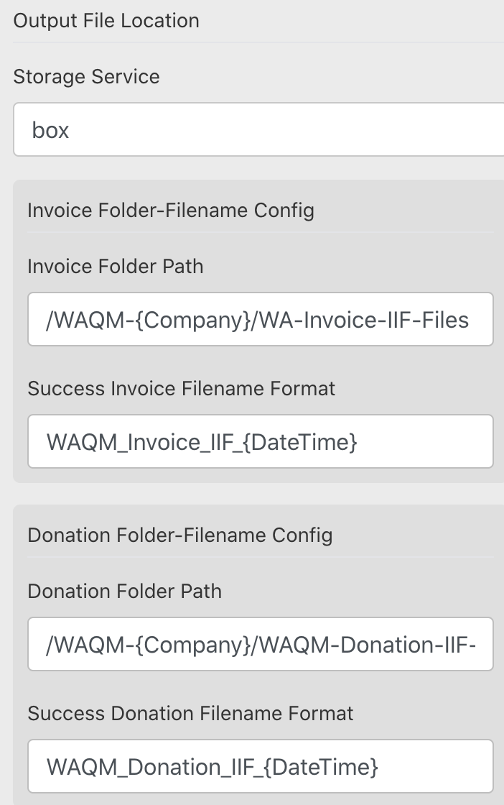

Notification Emails: This section defines the email addresses that will be used to send notifications when the scenarios run. There are generally 2 email notifications that may be generated per run:  

* A "success" email:  This lists the invoices that were successfully processed by WAQM.  The Quickbooks Desktop version provides a link to the IIF file that is generated and loaded to the storage service.   The Quickbooks Online version provides links to each document that was created.  and a  "mapping error" email.  
* A "mapping error" email:  This lists the invoices that were not mapped successfully based on the WAQM config and the info that was extracted from Wild Apricot.  

Both types will describe the dates used for a WAQM run and other reference information.  To support notifications the email domain must be configured inside Integromat Mailgun utility.

* Company Email Address: The To: email address.   This should be the list of emails from the client that will receive notifications when WAQM runs.
  * NOTE:  The first listed company email will be used as the From: address.
* Support Email Address: The cc: email address.  This is typically the NewPath Consulting support email address\(es\) that will receive notifications when WAQM runs.

NOTE:  WAQM will use the first email address in the "Company Address" section as the Sent From email address.

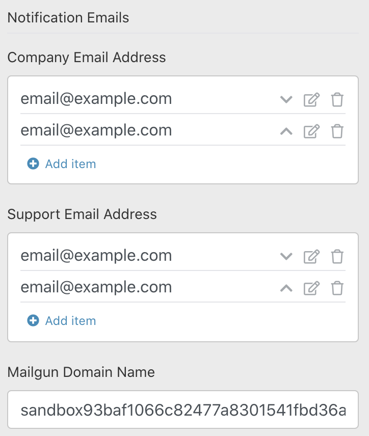

## 

