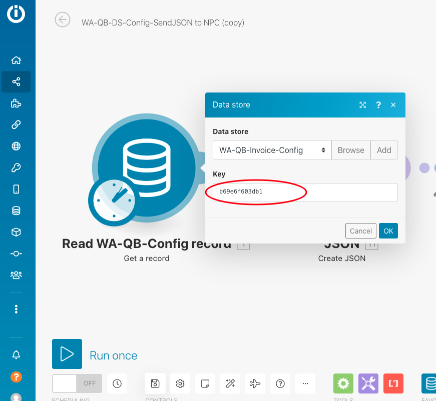

# Managing Config Key Records

### WAQM configuration “key” records

WAQM uses the Integromat Data Store to configure mappings from Wild Apricot to Quickbooks. Only 1 row \(record\) is needed to correctly configure WAQM for Invoices and Donations. Other records are backups or specific to separate test environments.

In both of the primary Scenarios \(Invoice and Donation\), the first “module” inside the scenario lists the configuration “key” that corresponds to the appropriate record in the configuration Data Store. These screenshots show this key in a scenario and inside the Data Store.

### Backing up a WAQM configuration record

Recommendation: Before making WAQM configuration changes, use the Backup scenario to create a copy of the current configuration.

The Backup scenario creates a new record in the configuration Data Store with a new key. The Invoice and Donation scenarios will be unchanged and will still point to the previously used configuration key record.

1. Open Integromat Scenario “WA-QB-Config-BackupRecord”.
2. Confirm the first module is pointed to the correct record “key” that is currently being used by the Invoice and Donation scenarios.
3. “Run Once” the “WA-QB-Config-BackupRecord” scenario.
4. If successful, the record is copied and added to the Data Store with a new key. The “WA Org Env” field will copy the original value and add the suffix “-BACKUP-YYYY-MM-DD”.
5. Changes can now be made to the original configuration record key.
6. If needed, the Invoice and Donation scenarios can be changed to refer to different record keys \(in the 1st module of each scenario\).

### Re-pointing Integromat Scenarios to use a different Configuration Record

In most cases, this action is not required. Re-pointing scenarios to a different record in the Config Data Store is typically done when referring back to an old configuration record.

Steps:

1. Open the “WA-QB-Invoice-Config” Data Store.
2. Identify the record that should be used for running the Integromat scenarios.
3. Make a note of the key for that record. NOTE: Integromat does not allow this to be copied directly.
4. Go to the Invoice scenario and click to open.
5. Navigate \(drag the screen with mouse\) so that you can see the first module to the left \(Get WA-QB Config\).
6. Click on the module to open its properties.
7. Change the value in the Key field to match the key from the Config Data Store.
8. Click OK.
9. Click the Save icon on the bottom left of the screen.
10. Repeat steps 4-9 for the Donation scenario.

