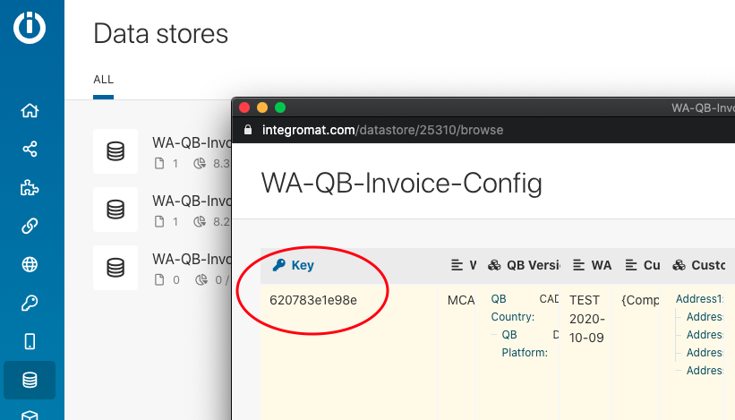

# Managing Config Key Records

### WAQM configuration “key” records

WAQM uses the Integromat Data Store to configure mappings from Wild Apricot to Quickbooks. Only 1 row (record) is needed to correctly configure WAQM for all transaction types. Other records are backups or specific to separate tests.

Inside the Core Scenarios for each transaction, the first “module” inside the scenario lists the configuration “key” that corresponds to the appropriate record in the configuration Data Store. These screenshots show this key in a scenario and inside the Data Store.  These must match exactly in order to use the desired configuration.

### Backing up a WAQM configuration record

Recommendation: Before making WAQM configuration changes, use the Backup scenario to create a copy of the current configuration.

The Backup scenario creates a new record in the configuration Data Store with a new key and the phrase "-BACKUP" appended to the end of the Config Record Name. The Integromat Core scenarios will be unchanged and will still point to the previously used configuration key record.

1. Open the Integromat Scenario “WAQM DS Record Backup”.
2. Confirm the first module is pointed to the correct record “key” from the Data Store that you wish to Backup.
3. Click the “Run Once” button inside the Backup scenario.
4. If successful, the record is copied and added to the Data Store with a new key. The “Config Record Name” field will copy the original value and add the suffix “-BACKUP”.
5. Changes can now be made to the original configuration record key.
6. If needed, each Core scenarios can be changed to refer to different record keys (in the 1st module of each scenario).  See the next section.

### Re-pointing Integromat Scenarios to use a different Configuration Record

In most cases, this action is not required. Re-pointing scenarios to a different record in the Config Data Store is typically done when referring back to an old configuration record.

Steps:

1. Open the WAQM Config Data Store.
2. Identify the desired record that should be used for running the Integromat scenarios.
3. Make a note of the key for that record. NOTE: Integromat does not allow this to be copied directly.
4. Go to the desired Core scenario and click to open.
5. Navigate (drag the screen with mouse) so that you can see the first module to the left (titled Config Key).
6. Click on the module to open its properties.
7. Change the value in the Key field to match the key from the Config Data Store.
8. Click OK.
9. Click the Save icon on the bottom left of the scenario screen.
10. Exit the Scenario edit mode.
11. Repeat steps 4-10 for the other Core scenarios.

NOTE: The Config Key does not need to be set for the Transaction Loader scenarios (QBD or QBO).  They read the config that was used in the Core scenario for processing.
