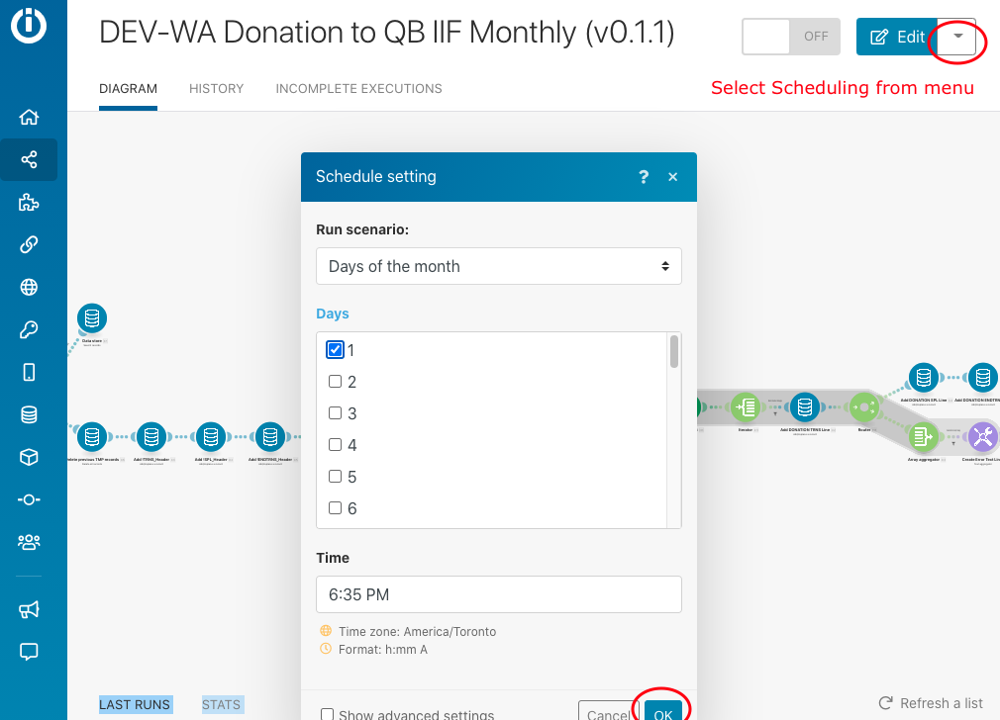

# WAQM Scheduling Options

### Changing Scheduling Configuration and Running Manually

The WAQM scenarios may be set-up to run on a specific schedule automatically or they may be run manually for a defined set of start and end dates. The Invoice or Donation Document Date from Wild Apricot is used.

**Automatic Scheduling**

1. In the configuration Data Store, go to the sections for Invoice Time Periods and/or Donation Time Periods.
   1. Make sure the “activation” field is set to Yes
   2. In the Scheduling Type field use: Scheduled
   3. In the Scheduled Number of Months Back field, insert the whole number of months back
   4. For reference, describe the planned Schedule Frequency in the Run Schedule field.
   5. Save Record
2. Go to each Scenario and set-up the schedule: \(see screenshot\)
   1. Go to the scenario.
   2. In the upper right, select Scheduling from the Options menu. \(If you don’t see the option, you may be in edit mode. Exit the edit mode.\)
   3. Choose the Run Scenario - Days of Month.
   4. Select the day of the month and time when you want the scenario to run.
   5. Click OK
   6. Make sure the scenario toggle is turned On in the upper right corner.

At the specified schedule, the scenario\(s\) will run. When completed, an email will be sent to the designated email address with links to the resulting files.

**Running Manually**

1. In the configuration Data Store, go to the sections for Invoice Time Periods and/or Donation Time Periods.
   1. Make sure the “activation” field is set to Yes
   2. In the Scheduling Type field use: Manual Dates
   3. In the Manual Start Date field, enter the date in YYYY-MM-DD format
   4. In the Manual End Date field, enter the date in YYYY-MM-DD format
   5. Save Record
2. Go to the Scenario and run
   1. Go to the scenario
   2. Click and make sure it is in the Edit mode
   3. Click the Run Once button on the bottom left

NOTE: If the automatic schedule is set up on the scenario \(e.g. run automatically every month\), it will not work correctly if the configuration data store is not changed back to the “Scheduled” Scheduling Type.

### 

