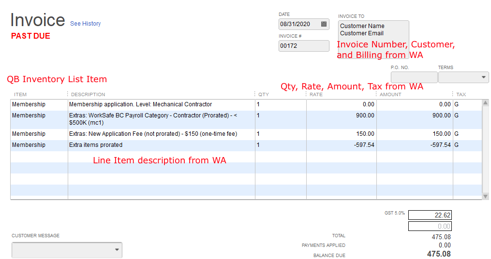

# WAQM Capabilities

#### Core functions provided by WAQM

* Read Wild Apricot data to create an invoice or donation \(sales receipt\) inside Quickbooks.
* For Quickbooks Desktop, this is in the form of an IIF file that may be imported to Quickbooks Desktop
  * When the IIF Invoice file is imported to Quickbooks Desktop, Quickbooks Invoices are created that match the Wild Apricot invoice \(customer, line items, amounts, tax amounts\) 
  * When the IIF Donation file is imported to Quickbooks Desktop, Quickbooks Sales Receipts are created that match the Wild Apricot donation \(customer, line items, amounts\) 
* Quickbooks invoices are matched to the proper AR, Income, and Sales Tax Payable accounts and classes based on the Wild Apricot Invoice type 
* Exception line item Income account mappings are possible based on Wild Apricot ExtraCost fields 
* Create Quickbooks customer if it does not already exist

#### Sample Quickbooks Invoice created from Wild Apricot data

#### 

